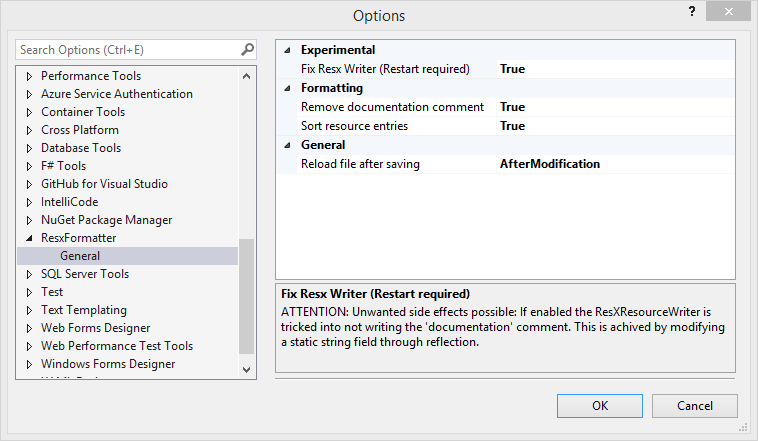

# ResxFormatter
Optimizes resx files after saving: Removes schema and comments (in particular the 3KB documentation that is included in every resx file) and sorts entries alphabetically so that they look like this:
```xml
<?xml version="1.0" encoding="utf-8"?>
<root>
  <schema />
  <resheader name="resmimetype">
    <value>text/microsoft-resx</value>
  </resheader>
  <resheader name="version">
    <value>2.0</value>
  </resheader>
  <resheader name="reader">
    <value>System.Resources.ResXResourceReader, System.Windows.Forms, Version=4.0.0.0, Culture=neutral, PublicKeyToken=b77a5c561934e089</value>
  </resheader>
  <resheader name="writer">
    <value>System.Resources.ResXResourceWriter, System.Windows.Forms, Version=4.0.0.0, Culture=neutral, PublicKeyToken=b77a5c561934e089</value>
  </resheader>
  <data name="a" xml:space="preserve">
    <value>LESS CLUTTER</value>
  </data>
  <data name="b" xml:space="preserve">
    <value>SORTED BY KEYS</value>
  </data>
</root>
```


Use only with a source control system and at your own risk. See the [change log](CHANGELOG.md) for changes and road map.

----
Download this extension from the [Visual Studio Marketplace](https://marketplace.visualstudio.com/items?itemName=stefan-egli.ResxFormatter)
or get the [CI build](http://vsixgallery.com/extension/ResxFormatter.61507132-4401-47b1-9950-575e43b964c6/).


[](https://ci.appveyor.com/project/stefanegli/resxformatter)


# Settings

## EditorConfig
Formatting rules are configured in the [EditorConfig](https://editorconfig.org/) file as follows:

```ini
[*.resx]
resx_formatter_sort_entries=true
resx_formatter_remove_xsd_schema=true
resx_formatter_remove_documentation_comment=true
resx_formatter_sort_comparer=OrdinalIgnoreCase
```

Comparer can be one of the following: _InvariantCulture, InvariantCultureIgnoreCase, OrdinalIgnoreCase, Ordinal_. The default value is _Ordinal_.

When the [EditorConfig Language Service](https://github.com/madskristensen/EditorConfigLanguage) version 1.18.35 or newer is installed, the ResxFormatter VSIX contributes these properties to its IntelliSense and validation. Restart Visual Studio after installing or updating either extension so that the custom schema is loaded.

| :information_source: You can format all resx files in the current solution folder via Extensions > ResxFormatter menu. |
| ---- |


## Visual Studio
A few things can be configured and probably you want to have this done as follows:



> Use the experimental setting with caution since it may have undesired side effects. It is also worth to note,
> that the extension may insert schema or documentation comment in order to match the desired effect of your EditorConfig settings.

# CLI
The repository includes a console app named `resxfmt` that applies the same formatting rules as the VS extension.
It targets .NET 10.

Publish:
```
dotnet publish ResxFormatter.Cli/ResxFormatter.Cli.csproj -c Release --nologo
```

Publish output:
- `artifacts/publish/ResxFormatter.Cli/release/resxfmt.exe`

Build an installable Codex skill containing the complete published CLI:

```powershell
.\build-cli-skill.ps1
```

Package output:

- `artifacts/packages/resxfmt-cli-<version>.zip`
- The ZIP contains `resxfmt-cli/SKILL.md`, `resxfmt-cli/assets/cli/win-x64/resxfmt.exe`, and `resxfmt-cli/assets/cli/linux-x64/resxfmt`.
- Each CLI is a framework-dependent single file. The target machine must have the .NET 10 runtime.
- Single-file publishing is runtime-specific, so Windows and Linux require separate binaries. ReadyToRun is disabled.
- Extract `resxfmt-cli` into the Codex skills directory to install it.
- Local packages use the VSIX version and normalize a missing build component to `0`. AppVeyor packages use `4.0.<build>`.

Supply an explicit version when needed:

```powershell
.\build-cli-skill.ps1 -Version 4.0.123
```

Usage:
```
resxfmt [options] [<path> ...]
```

Options:
- `-r`, `--recursive` Recurse into subdirectories when a path is a directory.
- `-v`, `--verbose` Show per-file status and errors.
- `-n`, `--dry-run` Show what would change without writing files.
- `--check` Exit with code 1 if any file would change (implies `--dry-run`).

Output:
- Prints one line per file with a status (`updated`, `unchanged`, `skipped`).
- Paths are shown relative to the current working directory.
- `skipped` means formatting is disabled by EditorConfig for that file.

Default path behavior:
- If no path is provided, the current directory is processed.


# Contributing
Please use the [issue tracker](https://github.com/stefanegli/ResxFormatter/issues) for submitting bug reports or feature requests.

# License
[MIT License](LICENSE)

## Third Party Licenses

| Library | License |
| ------- |---------|
| [EditorConfig .NET Core](https://github.com/editorconfig/editorconfig-core-net) | [MIT License](https://github.com/editorconfig/editorconfig-core-net/blob/master/LICENSE) |
| [xUnit](https://github.com/xunit/xunit) | [Apache License 2.0 / MIT License](https://github.com/xunit/xunit/blob/main/LICENSE) |
| [NFluent](https://github.com/tpierrain/NFluent) | [Apache License 2.0](https://github.com/tpierrain/NFluent/blob/master/LICENSE.txt) |
| [Community toolkit for Visual Studio extensions](https://github.com/VsixCommunity/Community.VisualStudio.Toolkit) | [Apache License 2.0](https://github.com/VsixCommunity/Community.VisualStudio.Toolkit/blob/master/LICENSE) |
