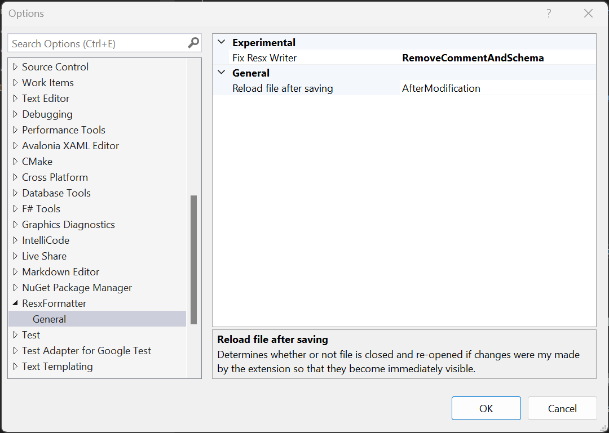

# ResxFormatter
Optimizies resx files after saving: Removes comments (in particular the 3KB documentation that is included in every resx file) and sorts entries alphabetically. Use only with a source control system and at your own risk.

See the [change log](CHANGELOG.md) for changes and road map.

----
Download this extension from the [Visual Studio Marketplace](https://marketplace.visualstudio.com/items?itemName=stefan-egli.ResxFormatter)
or get the [CI build](http://vsixgallery.com/extension/ResxFormatter.61507132-4401-47b1-9950-575e43b964c6/).

# Settings
A few things can be configured and probably you want to have this done as follows:

> Use the experimental setting with caution since it may have undesired side effects.

# Contributing
Please use the [issue tracker](https://github.com/stefanegli/ResxFormatter/issues) for submitting bug reports or feature requests.

# License
[MIT License](LICENSE)
